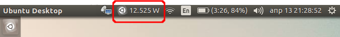
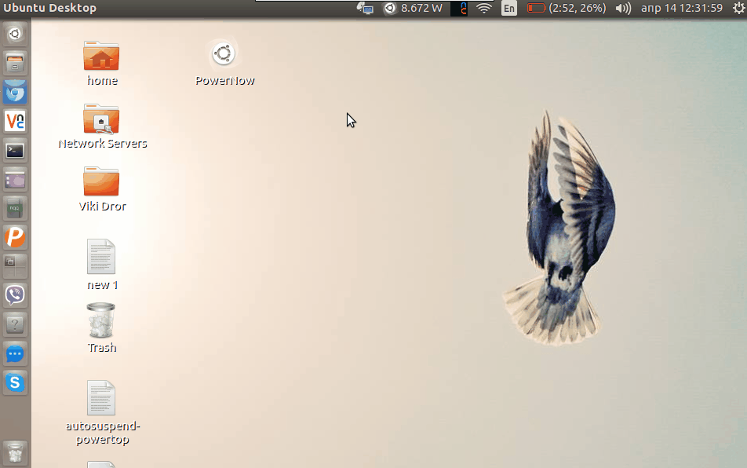

# Power Now - Power Consumption Indicator

The script display the current power consumption of your laptop. The initial attention was to be just **Power Consumption Indicator**. But now it has menu which call few tool within `gnome-terminal` window. Thats are `htop`, `powertop`, `tlp stat`. If any of the tools is not installed on the system, the script will ask you to install it.



The script works with **Ubuntu 16.04** and probably the only system specific thing is the file where the value of the current power consumption is stored. In my case I found it by the help of `tlp`:

```bash
$ sudo tlp stat | grep -P '\[m(W|A)\]'       # Output on Lenovo ThinkPad X230 Laptop-Tablet
/sys/class/power_supply/BAT0/power_now                      =  11246 [mW]

$ sudo tlp stat | grep -P '\[m(W|A)\]'       # Output on Dell Vostro 3350 Laptop
/sys/class/power_supply/BAT0/power_now                      =  6700 [mA]
````

Note some devices provide the current **power** consumption in watts, but some devices provide the current values of the **voltage** and the **current** (amps) and - we must calculate the current power. The script covers these cases.

## Installation

- Copy the script to `/usr/local/bin` to make it accessible as shell command system wide:
    ```bash
    sudo wget https://raw.githubusercontent.com/metalevel-tech/powerNow/master/powerNow.py -O /usr/local/bin/powerNow
    sudo chmod +x /usr/local/bin/powerNow
    ````

- Copy the script to `~/bin` to make it accessible only for the current user:
    ```bash
    wget https://raw.githubusercontent.com/metalevel-tech/powerNow/master/powerNow.py -O $HOME/bin/powerNow
    chmod +x $HOME/bin/powerNow
    ````
- Copy the desktop file to `~/Desktop` (the script is required):
    ```bash
    wget https://raw.githubusercontent.com/metalevel-tech/powerNow/master/powerNow.desktop -O $HOME/Desktop/powerNow.desktop
    chmod +x $HOME/Desktop/powerNow.desktop
    ````

- Copy the desktop file to `~/.config/autostart` (the script is required):
    ```bash
    wget https://raw.githubusercontent.com/metalevel-tech/powerNow/master/powerNow.desktop -O $HOME/.config/autostart/powerNow.desktop
    chmod +x $HOME/.config/autostart/powerNow.desktop
    ````

## Usage



## Tests

The application is tested on:

- Lenovo ThinkPad X230 Laptop-Tablet with Ubuntu 16.04

- Dell Vostro 3350 Laptop with Ubuntu 16.04

## References

Note: This is my very first Python attempt so I've used couple of references:

- [How do I get the current power consumption in the status bar? (Developing a status icon)][1]
- [AppIndicator3: Set indicator icon from file name or GdkPixbuf][2]
- [Writing indicators with Python, GIR and GTK3][3]
- [Create an Ubuntu Application Indicator in Python: step-by-step guide][4]
- [AppIndicator3 Documentation][5] (also [here][6])
- [Unix & Linux: How to find power draw in watts?][7] | [Watts / Volts / Amps / Ohms][8]
- [Hands-on Python Tutorial » 3. More On Flow of Control » 3.1. If Statements][9]
- [TypeError: worker() takes 0 positional arguments but 1 was given][10]
- [Graphical environment in gtk+ programming](https://askubuntu.com/q/1024989/566421)
- [Anjuta DevStudio](https://developer.gnome.org/anjuta-manual/stable/)
- [Glade - A User Interface Designer](https://glade.gnome.org/index.html)

## In Addition

I can call this simple tool also **my laptop power management bundle**, so here are few specifics according the usage of `tlp` and `powertop` on my Lenovo Lenovo ThinkPad X230 Laptop-Tablet:

- Installation and basic usage of `tlp`:

  - Install the package: `sudo apt update && sudo apt install tlp`.

  - If you are using [`tp-smapi`][11] the [better way][12] to install the package is:

     ````bash
    sudo add-apt-repository ppa:linrunner/tlp
    sudo apt-get update
    sudo apt-get install tlp tlp-rdw
    sudo apt-get install tp-smapi-dkms acpi-call-dkms
    ````

- There are two services that will be installed `tlp.service` and `tlp-sleep.service`.

- Use `sudo tlp stat` to check the current settings.

- Use `nano /etc/default/tlp` to tweak the configuration.

- Use `sudo tlp start` to apply the configuration.

The tool `powertop` is not just a monitoring tool it has also a calibrating option: `powertop -c`, and manual handling of the power management for the peripheral devices.

See also:

- [Extending Ubuntu's Battery Life](https://www.phoronix.com/scan.php?page=article&item=ubuntu_battery_life&num=2)
- [TLP FAQ](http://linrunner.de/en/tlp/docs/tlp-faq.html)

  [1]: https://askubuntu.com/q/820842/566421
  [2]: https://askubuntu.com/q/770036/566421
  [3]: https://askubuntu.com/q/108035/566421
  [4]: http://candidtim.github.io/appindicator/2014/09/13/ubuntu-appindicator-step-by-step.html
  [5]: http://devdocs.baznga.org/appindicator301~0.1_api/
  [6]: https://lazka.github.io/pgi-docs/AppIndicator3-0.1/classes/Indicator.html#AppIndicator3.Indicator.set_label
  [7]: https://unix.stackexchange.com/questions/10418/how-to-find-power-draw-in-watts
  [8]: https://www.rapidtables.com/calc/electric/watt-volt-amp-calculator.html
  [9]: https://anh.cs.luc.edu/python/hands-on/3.1/handsonHtml/ifstatements.html
  [10]: https://stackoverflow.com/q/18884782/6543935
  [11]: http://linrunner.de/en/tlp/docs/tlp-faq.html#kernmod
  [12]: https://bugs.launchpad.net/ubuntu/+source/tp-smapi/+bug/1633216
