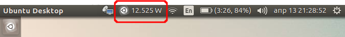

# Power Now - Power Consumption Indicator

The script display the current power consuption of your laptop. The initial attention was to be just **Power Consumption Indicator**. But now it has menu which call few tool within `gnome-terminal` window. Thats are `htop`, `powertop`, `tlp stat`. If any of the tools is not installwd on the sistem, the script will ask you to install it.



The script works with **Ubuntu 16.04** and probably the only system specific thing is the file where the value of the current power consumption is stored. In my case I found it by the help of `tlp`:

```bash
$ sudo tlp stat | grep -P '\[m(W|A)\]'       # Output on Lenovo ThinkPad X230 Laptop-Tablet
/sys/class/power_supply/BAT0/power_now                      =  11246 [mW]

$ sudo tlp stat | grep -P '\[m(W|A)\]'       # Output on Dell Vostro 3350 Laptop
/sys/class/power_supply/BAT0/power_now                      =  6700 [mA]
````

**Note** some devices provide the current power consumption in watts, but some devices provides current values of the voltage and the current (amps) - in this case we must calculate the current power.

## Installation

...

## Usage

...

## References

Note: This is my very first Python attempt.

- [Developing a status icon (ubuntu)][1]
- [AppIndicator3: Set indicator icon from file name or GdkPixbuf][2]
- [Writing indicators with Python, GIR and GTK3][3]
- [Create an Ubuntu Application Indicator in Python: step-by-step guide][4]
- [AppIndicator3 Documentation][5] (also [here][6])
- [Unix & Linux: How to find power draw in watts?][7] | [Watts / Volts / Amps / Ohms][8]
- [Hands-on Python Tutorial » 3. More On Flow of Control » 3.1. If Statements][9]
- [TypeError: worker() takes 0 positional arguments but 1 was given][10]

  [1]: https://askubuntu.com/q/820842/566421
  [2]: https://askubuntu.com/q/770036/566421
  [3]: https://askubuntu.com/q/108035/566421
  [4]: http://candidtim.github.io/appindicator/2014/09/13/ubuntu-appindicator-step-by-step.html
  [5]: http://devdocs.baznga.org/appindicator301~0.1_api/
  [6]: https://lazka.github.io/pgi-docs/AppIndicator3-0.1/classes/Indicator.html#AppIndicator3.Indicator.set_label
  [7]: https://unix.stackexchange.com/questions/10418/how-to-find-power-draw-in-watts
  [8]: https://www.rapidtables.com/calc/electric/watt-volt-amp-calculator.html
  [9]: https://anh.cs.luc.edu/python/hands-on/3.1/handsonHtml/ifstatements.html
  [10]: https://stackoverflow.com/q/18884782/6543935